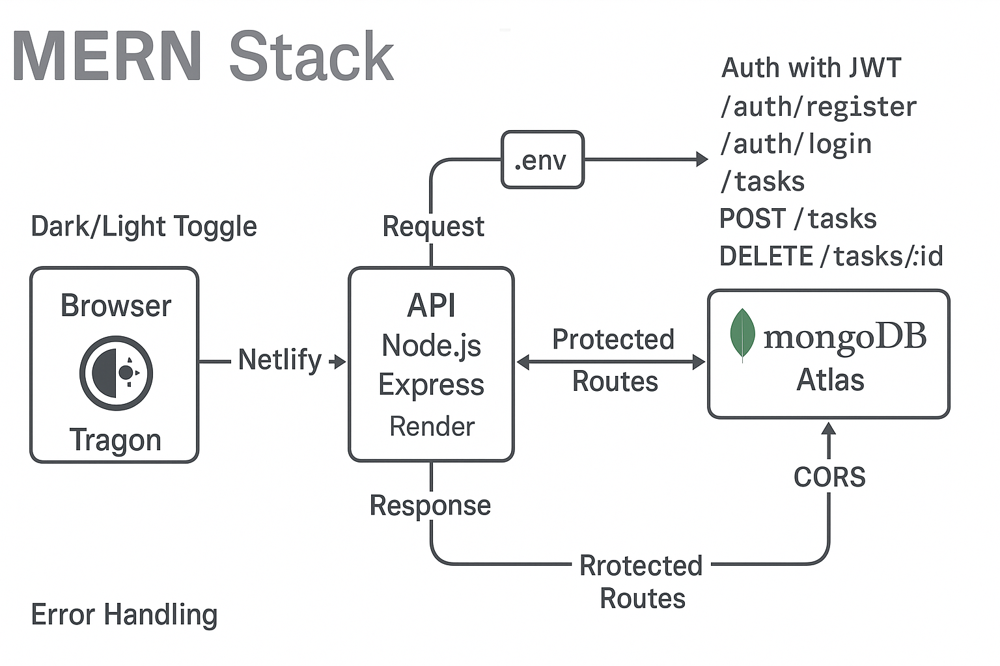

# To‑Do List App (MERN)

A full‑stack task manager with authentication, dark/light mode, and a clean React UI.

**Live Demo:** https://task-manager-calchang1994.netlify.app  
**API Base URL:** https://task-manager-api-g0uk.onrender.com

---

## Architecture



---

## Tech Stack
- **Frontend:** React + Vite, fetch API, localStorage for JWT & theme
- **Backend:** Node.js, Express, JWT auth, bcrypt
- **Database:** MongoDB Atlas
- **Hosting:** Netlify (frontend), Render (backend)

## Features
- Register/Login with JWT
- Create, read, update, and delete tasks
- Mark complete/incomplete
- Dark/Light theme toggle (persisted)
- Protected routes on both client & server
- Helpful error messages and loading states

## REST API
**Auth**
- `POST /auth/register` → create user  
- `POST /auth/login` → authenticate and return JWT

**Tasks** (require `Authorization: Bearer <token>`)
- `GET /tasks` → list tasks
- `POST /tasks` → create task (body: `{ "title": "string", "completed": false }`)
- `PUT /tasks/:id` → update task
- `DELETE /tasks/:id` → delete task

## Quick Start (Local)
### 1) Backend
```bash
git clone <your-repo> todo-app
cd todo-app/backend
npm install
cp .env.example .env
# edit .env with your values
npm run dev
```
`.env` (example):
```bash
PORT=8080
MONGO_URI=mongodb+srv://<user>:<password>@<cluster-url>/<dbname>?retryWrites=true&w=majority
JWT_SECRET=replace_me
CORS_ORIGIN=http://localhost:5173
```

### 2) Frontend
```bash
cd ../frontend
npm install
npm run dev
```

## cURL Smoke Tests
> Replace `{{TOKEN}}` with the JWT from `/auth/login`.

```bash
# Register
curl -X POST https://task-manager-api-g0uk.onrender.com/auth/register   -H "Content-Type: application/json"   -d '{"username":"demo","password":"demo123"}'

# Login
curl -X POST https://task-manager-api-g0uk.onrender.com/auth/login   -H "Content-Type: application/json"   -d '{"username":"demo","password":"demo123"}'

# Get tasks
curl -X GET https://task-manager-api-g0uk.onrender.com/tasks   -H "Authorization: Bearer {{TOKEN}}"

# Create task
curl -X POST https://task-manager-api-g0uk.onrender.com/tasks   -H "Content-Type: application/json"   -H "Authorization: Bearer {{TOKEN}}"   -d '{"title":"First task"}'

# Update task
curl -X PUT https://task-manager-api-g0uk.onrender.com/tasks/<TASK_ID>   -H "Content-Type: application/json"   -H "Authorization: Bearer {{TOKEN}}"   -d '{"completed":true}'

# Delete task
curl -X DELETE https://task-manager-api-g0uk.onrender.com/tasks/<TASK_ID>   -H "Authorization: Bearer {{TOKEN}}"
```

## Deploy
- **Frontend (Netlify):** connect repo → build command: `npm run build` in `/frontend`, publish dir: `dist`
- **Backend (Render):** web service → start: `node server.js` (or `npm start`), set env vars: `MONGO_URI`, `JWT_SECRET`, `CORS_ORIGIN`
- **CORS:** allow your Netlify domain in backend env vars

## Troubleshooting
- **401 Unauthorized:** missing/expired JWT; ensure `Authorization: Bearer <token>` header
- **500 errors on tasks:** verify `MONGO_URI` and DB user permissions
- **CORS errors:** set `CORS_ORIGIN` to your Netlify URL
- **Bad hostname in cURL:** use full `https://` URL

---

© 2025 Calvin Chang. MIT License.